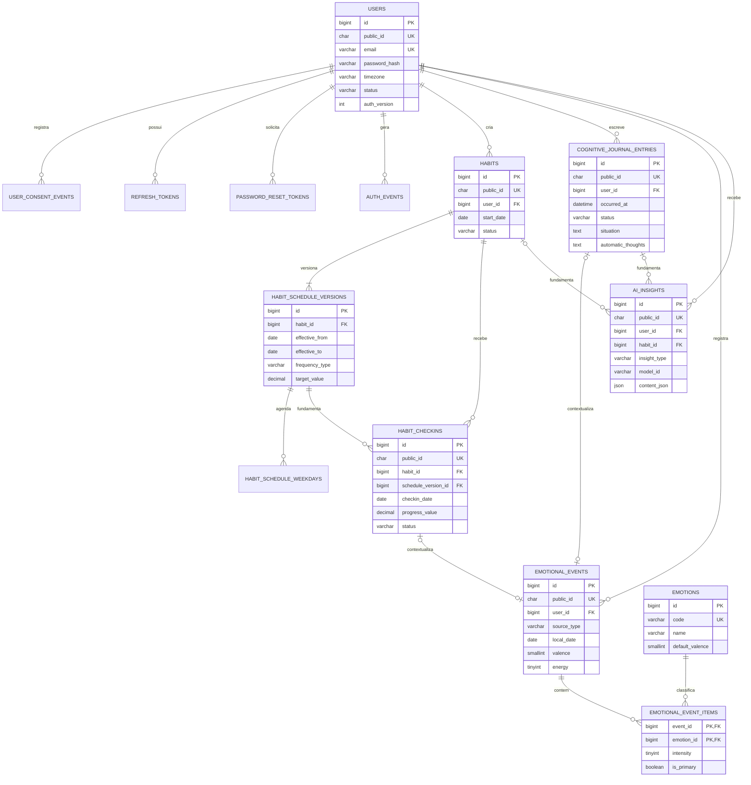

# Habitus — Modelagem MySQL do MVP

> Status: modelo lógico proposto; o DDL executável será criado após aprovação.  
> Banco-alvo: MySQL 8+, InnoDB, `utf8mb4`, timezone da conexão em UTC.

## 1. Convenções

- Todas as tabelas de negócio usam `BIGINT UNSIGNED AUTO_INCREMENT` internamente.
- Recursos expostos pela API também possuem `public_id CHAR(36) CHARACTER SET ascii` único, gerado pela aplicação.
- Horários são `DATETIME(3)` em UTC. Datas civis são `DATE` interpretadas no fuso salvo no perfil.
- Colunas de FK recebem índice; nomes seguem `snake_case`.
- Valores restritos usam `CHECK` ou tabelas de catálogo. O service reforça regras entre colunas.
- Exclusões do MVP são físicas e síncronas quando solicitadas pelo usuário; retenção de auditoria anonimizada e expiração de backups serão definidas na política LGPD antes da produção.

## 2. Entidades e campos

### `users`

Identidade, credencial e preferências essenciais do usuário.

| Campo | Tipo | Regra |
|---|---|---|
| `id` | BIGINT UNSIGNED | PK |
| `public_id` | CHAR(36) ASCII | UNIQUE, NOT NULL |
| `name` | VARCHAR(120) | NOT NULL |
| `email` | VARCHAR(254) | normalizado, UNIQUE, NOT NULL |
| `password_hash` | VARCHAR(255) | bcrypt, NOT NULL |
| `timezone` | VARCHAR(64) | NOT NULL, padrão `America/Sao_Paulo` |
| `locale` | VARCHAR(10) | NOT NULL, padrão `pt-BR` |
| `status` | VARCHAR(20) | `active`, `blocked` |
| `auth_version` | INT UNSIGNED | NOT NULL, padrão 1; invalidação global de JWT |
| `password_changed_at` | DATETIME(3) | NOT NULL |
| `last_login_at` | DATETIME(3) | NULL |
| `created_at`, `updated_at` | DATETIME(3) | NOT NULL |

Índices: único em `email`, único em `public_id`, `(status)`, `(created_at)`.

### `user_consent_events`

Histórico append-only de aceite e revogação. O estado atual é o evento mais recente de cada tipo; eventos anteriores nunca são atualizados.

| Campo | Tipo | Regra |
|---|---|---|
| `id` | BIGINT UNSIGNED | PK |
| `user_id` | BIGINT UNSIGNED | FK `users`, NOT NULL |
| `consent_type` | VARCHAR(30) | `terms`, `privacy`, `ai_processing` |
| `document_version` | VARCHAR(30) | NOT NULL |
| `action` | VARCHAR(10) | `granted` ou `revoked` |
| `occurred_at` | DATETIME(3) | NOT NULL |
| `created_at` | DATETIME(3) | NOT NULL |

Índice: `(user_id, consent_type, occurred_at, id)`. Termos e privacidade vigentes são necessários para manter a conta; IA é sempre opcional. Revogar IA impede novas gerações, sem apagar automaticamente registros anteriores. Revogar termos/privacidade inicia o fluxo confirmado de exclusão da conta.

### `refresh_tokens`

Sessões renováveis com rotação e detecção de reutilização.

| Campo | Tipo | Regra |
|---|---|---|
| `id` | BIGINT UNSIGNED | PK |
| `user_id` | BIGINT UNSIGNED | FK `users`, NOT NULL |
| `family_id` | CHAR(36) ASCII | NOT NULL |
| `token_hash` | CHAR(64) ASCII | SHA-256, UNIQUE, NOT NULL |
| `expires_at` | DATETIME(3) | NOT NULL |
| `revoked_at` | DATETIME(3) | NULL |
| `replaced_by_id` | BIGINT UNSIGNED | FK auto-referente, NULL |
| `last_used_at` | DATETIME(3) | NULL |
| `user_agent` | VARCHAR(255) | NULL, truncado |
| `ip_hmac` | CHAR(64) ASCII | NULL; HMAC com segredo rotacionável |
| `created_at` | DATETIME(3) | NOT NULL |

Índices: `token_hash`, `(family_id)`, `(user_id, revoked_at, expires_at)`.

### `password_reset_tokens`

| Campo | Tipo | Regra |
|---|---|---|
| `id` | BIGINT UNSIGNED | PK |
| `user_id` | BIGINT UNSIGNED | FK `users`, NOT NULL |
| `token_hash` | CHAR(64) ASCII | UNIQUE, NOT NULL |
| `expires_at` | DATETIME(3) | NOT NULL |
| `used_at` | DATETIME(3) | NULL |
| `requested_ip_hmac` | CHAR(64) ASCII | NULL |
| `created_at` | DATETIME(3) | NOT NULL |

Índice: `(user_id, expires_at, used_at)`.

### `auth_events`

Auditoria mínima de segurança, sem credenciais ou conteúdo pessoal.

Campos: `id`, `user_id` opcional, `event_type`, `ip_hmac`, `user_agent`, `metadata JSON`, `created_at`.

Eventos iniciais: `register`, `login_success`, `login_failure`, `refresh`, `logout`, `password_reset`, `password_changed`, `token_reuse`.

Índices: `(user_id, created_at)`, `(event_type, created_at)`.

### `habits`

| Campo | Tipo | Regra |
|---|---|---|
| `id` | BIGINT UNSIGNED | PK |
| `public_id` | CHAR(36) ASCII | UNIQUE, NOT NULL |
| `user_id` | BIGINT UNSIGNED | FK `users`, NOT NULL |
| `name` | VARCHAR(120) | NOT NULL |
| `description` | VARCHAR(500) | NULL |
| `color` | CHAR(7) ASCII | formato hexadecimal validado |
| `icon` | VARCHAR(50) | NULL |
| `start_date` | DATE | NOT NULL |
| `end_date` | DATE | NULL, não anterior ao início |
| `status` | VARCHAR(20) | `active`, `archived` |
| `created_at`, `updated_at` | DATETIME(3) | NOT NULL |
| `archived_at` | DATETIME(3) | NULL |

Índices: `(user_id, status)`, `(user_id, start_date, end_date)`.

`start_date` é imutável. `end_date` só pode ser incluída, removida ou movida enquanto o valor antigo e o novo forem hoje/futuros; um hábito já encerrado não é reaberto retroativamente. Essas regras preservam ocorrências históricas.

### `habit_schedule_versions`

Versões imutáveis da agenda e da meta, evitando que uma edição altere retroativamente streaks e dashboards.

| Campo | Tipo | Regra |
|---|---|---|
| `id` | BIGINT UNSIGNED | PK |
| `habit_id` | BIGINT UNSIGNED | FK `habits`, NOT NULL |
| `user_id` | BIGINT UNSIGNED | redundância controlada para FK composta de ownership |
| `effective_from` | DATE | NOT NULL |
| `effective_to` | DATE | NULL; intervalo fechado, não sobreposto |
| `frequency_type` | VARCHAR(30) | `daily`, `specific_weekdays`, `weekly_target` |
| `weekly_target` | TINYINT UNSIGNED | 1–7 apenas para `weekly_target` |
| `target_value` | DECIMAL(10,2) | maior que zero, padrão 1 |
| `unit` | VARCHAR(30) | NULL; ex.: minutos, copos |
| `created_at` | DATETIME(3) | NOT NULL |

Restrição única: `(habit_id, effective_from)`. O service encerra a versão vigente no dia anterior e cria a próxima em uma transação; intervalos não podem se sobrepor. Alteração retroativa de agenda não será aceita no MVP.

### `habit_schedule_weekdays`

Dias específicos de cada versão. `weekday` usa ISO: segunda=1, domingo=7.

Campos: `schedule_version_id` FK, `weekday TINYINT UNSIGNED CHECK (weekday BETWEEN 1 AND 7)`. PK composta `(schedule_version_id, weekday)`, com cascade ao remover a versão.

### `habit_checkins`

Registro diário idempotente. A ausência de linha não é persistida como `missed`; atraso é calculado pela agenda.

| Campo | Tipo | Regra |
|---|---|---|
| `id` | BIGINT UNSIGNED | PK |
| `public_id` | CHAR(36) ASCII | UNIQUE, NOT NULL |
| `habit_id` | BIGINT UNSIGNED | FK `habits`, NOT NULL |
| `schedule_version_id` | BIGINT UNSIGNED | FK da regra vigente, NOT NULL |
| `user_id` | BIGINT UNSIGNED | redundância controlada para FKs compostas |
| `checkin_date` | DATE | NOT NULL |
| `progress_value` | DECIMAL(10,2) | maior ou igual a zero |
| `target_snapshot` | DECIMAL(10,2) | meta vigente no dia |
| `status` | VARCHAR(20) | `in_progress`, `completed`, `skipped` |
| `note` | VARCHAR(500) | NULL |
| `completed_at` | DATETIME(3) | NULL; coerente com `completed` |
| `created_at`, `updated_at` | DATETIME(3) | NOT NULL |

Restrição única: `(habit_id, checkin_date)`. Índices: `(habit_id, status, checkin_date)`, `(schedule_version_id)`, `(checkin_date, status)`.

### `emotions`

Catálogo versionado por migration/seed de domínio.

Campos: `id`, `code VARCHAR(50) UNIQUE`, `name VARCHAR(80)`, `default_valence SMALLINT CHECK (-2..2)`, `is_active BOOLEAN`, `display_order`, `created_at`, `updated_at`.

`default_valence` serve apenas para organização do catálogo; telemetria usa a valência informada no evento e nunca a substitui silenciosamente. O catálogo definitivo deve ser validado por UX e pelo referencial do TCC antes do seed.

### `cognitive_journal_entries`

| Campo | Tipo | Regra |
|---|---|---|
| `id` | BIGINT UNSIGNED | PK |
| `public_id` | CHAR(36) ASCII | UNIQUE, NOT NULL |
| `user_id` | BIGINT UNSIGNED | FK `users`, NOT NULL |
| `title` | VARCHAR(150) | NULL |
| `occurred_at` | DATETIME(3) | NOT NULL |
| `status` | VARCHAR(20) | `draft` ou `completed` |
| `situation` | TEXT | NULL no rascunho; obrigatória ao concluir |
| `automatic_thoughts` | TEXT | NULL no rascunho; obrigatória ao concluir |
| `evidence_for` | TEXT | NULL |
| `evidence_against` | TEXT | NULL |
| `alternative_thought` | TEXT | NULL |
| `behavioral_response` | TEXT | NULL |
| `outcome` | TEXT | NULL |
| `last_saved_at` | DATETIME(3) | NOT NULL; confirmação de autosave |
| `lock_version` | INT UNSIGNED | controle otimista de concorrência |
| `created_at`, `updated_at` | DATETIME(3) | NOT NULL |

Índices: `(user_id, occurred_at)`, `(user_id, status, updated_at)`. Exclusão individual é física; autosave ocorre no servidor e o conteúdo nunca é colocado em `localStorage`.

### `emotional_events`

Fonte única dos registros emocionais. Pode ser espontâneo ou associado a um check-in/histórico cognitivo.

| Campo | Tipo | Regra |
|---|---|---|
| `id` | BIGINT UNSIGNED | PK |
| `public_id` | CHAR(36) ASCII | UNIQUE, NOT NULL |
| `user_id` | BIGINT UNSIGNED | FK `users`, NOT NULL |
| `source_type` | VARCHAR(30) | `standalone`, `habit_checkin`, `cognitive_journal` |
| `habit_checkin_id` | BIGINT UNSIGNED | FK opcional e UNIQUE |
| `cognitive_journal_entry_id` | BIGINT UNSIGNED | FK opcional e UNIQUE |
| `valence` | SMALLINT | NOT NULL, escala inteira de -2 a 2 |
| `energy` | TINYINT UNSIGNED | NOT NULL, escala inteira de 1 a 5 |
| `note` | VARCHAR(500) | NULL |
| `occurred_at` | DATETIME(3) | NOT NULL |
| `local_date` | DATE | NOT NULL, calculada no fuso do usuário |
| `created_at`, `updated_at` | DATETIME(3) | NOT NULL |

`standalone` não possui FK de origem; os outros tipos possuem exatamente a FK correspondente. FKs compostas garantem que origem e evento pertencem ao mesmo usuário, e o service reforça a regra.

Índices: `(user_id, local_date)`, `(user_id, occurred_at)`, `(user_id, source_type, local_date)`.

Escalas: valência `-2=muito desagradável`, `-1=desagradável`, `0=neutra/mista`, `1=agradável`, `2=muito agradável`; energia `1=muito baixa` a `5=muito alta`. O endpoint exige as duas respostas e a telemetria calcula suas médias separadamente, com uma casa decimal.

### `emotional_event_items`

Relação N:N entre evento e emoção.

Campos: `event_id` FK, `emotion_id` FK, `intensity TINYINT CHECK (1..5)`, `resulting_intensity TINYINT NULL CHECK (1..5)`, `is_primary BOOLEAN` e coluna gerada interna `primary_event_id`. PK `(event_id, emotion_id)` e índice único na coluna gerada garantem no máximo uma emoção primária mesmo sob concorrência. `resulting_intensity` é opcional e permite registrar a intensidade após a reflexão do Diário Cognitivo; nos demais contextos fica nula.

### `ai_insights`

| Campo | Tipo | Regra |
|---|---|---|
| `id` | BIGINT UNSIGNED | PK |
| `public_id` | CHAR(36) ASCII | UNIQUE, NOT NULL |
| `user_id` | BIGINT UNSIGNED | FK `users`, NOT NULL |
| `insight_type` | VARCHAR(30) | `habit_coaching`, `journal_reflection`, `emotional_summary` |
| `habit_id` | BIGINT UNSIGNED | FK opcional para `habit_coaching` |
| `cognitive_journal_entry_id` | BIGINT UNSIGNED | FK opcional |
| `period_start`, `period_end` | DATE | opcionais, período válido |
| `status` | VARCHAR(20) | `completed`, `failed`, `blocked` |
| `provider` | VARCHAR(30) | NOT NULL |
| `model_id` | VARCHAR(100) | NOT NULL |
| `prompt_version` | VARCHAR(30) | NOT NULL |
| `content_json` | JSON | NULL, saída validada |
| `safety_level` | VARCHAR(20) | `normal`, `sensitive`, `crisis` |
| `input_hash` | CHAR(64) ASCII | NOT NULL |
| `idempotency_key` | VARCHAR(100) | NOT NULL |
| `prompt_tokens`, `completion_tokens` | INT UNSIGNED | NULL |
| `latency_ms` | INT UNSIGNED | NULL |
| `error_code` | VARCHAR(50) | NULL |
| `created_at`, `updated_at`, `completed_at` | DATETIME(3) | conforme estado |

Restrição única: `(user_id, idempotency_key)`. Índices: `(user_id, insight_type, created_at)`, `(habit_id)`, `(cognitive_journal_entry_id)`. Um `habit_coaching` exige `habit_id`; `journal_reflection` exige diário; `emotional_summary` exige período. Exclusão individual é física.

O prompt bruto não será persistido. A chamada será síncrona no MVP; não existe estado `pending` sem worker. Recuperação de senha também envia e-mail de forma síncrona: se o provider falhar, o token recém-criado é invalidado e a resposta externa permanece genérica. Não haverá outbox contendo token bruto.

## 3. Diagrama entidade-relacionamento

O ERD destaca relacionamentos e atributos de identificação/regra; as tabelas acima são a especificação integral de campos.

## 4. Regras que não devem ser duplicadas no banco

- `missed`, streak, taxa de conclusão e agregações do dashboard são calculados a partir da agenda e check-ins.
- Mudanças de agenda/meta criam nova versão com vigência; `schedule_version_id` e `target_snapshot` preservam o passado.
- Nenhuma rota aceita `user_id`; a posse do recurso é sempre derivada da sessão.
- Alterações de hábito, check-in com emoções, refresh token e reset de senha são transacionais.
- O seed de emoções só será fechado após validação do vocabulário; não é dado mockado.

## 5. Política de FKs, exclusão e retenção

| Relação | Ação ao excluir o pai |
|---|---|
| usuário → tokens e consentimentos | `CASCADE` na exclusão física da conta |
| usuário → hábitos, diário, emoções e insights | `RESTRICT`; service remove explicitamente em ordem dentro da transação de conta |
| usuário → `auth_events` | `SET NULL`; metadados identificáveis são removidos |
| hábito → versões e check-ins | `RESTRICT`; no uso normal arquiva, e na conta o service exclui filhos primeiro |
| versão → dias | `CASCADE` |
| versão → check-ins | `RESTRICT`; versões usadas são imutáveis |
| check-in → evento emocional | `CASCADE`; itens do evento também usam `CASCADE` |
| diário → evento emocional e insight derivado | `CASCADE` |
| emoção de catálogo → itens históricos | `RESTRICT`; catálogo é desativado, não apagado |
| refresh token → substituto | `SET NULL` no vínculo auto-referente |

Na exclusão da conta, o service remove em ordem: insights; diários (com derivados); check-ins (com eventos); eventos espontâneos; versões/dias; hábitos; por fim o usuário, deixando tokens/consentimentos em cascade e auditoria anonimizada. Tokens expirados são removidos por comando operacional de manutenção; auth events terão retenção definida no documento LGPD antes da produção. Exportação e exclusão são síncronas. Cópias em backup expiram segundo a retenção do ambiente Railway.

## 6. Definições métricas propostas

Estas fórmulas tornam API e testes determinísticos, mas ainda exigem aprovação do TCC:

- **Ocorrência esperada:** data local coberta pela versão vigente e prevista por `daily`/dia específico. Para `weekly_target`, a unidade esperada é a semana ISO no fuso do usuário.
- **Concluído:** check-in com `status=completed` e `progress_value >= target_snapshot`.
- **Taxa diária/específica:** ocorrências concluídas ÷ ocorrências esperadas no período × 100; `skipped` permanece no denominador.
- **Taxa de meta semanal:** semanas que alcançaram `weekly_target` ÷ semanas elegíveis × 100.
- **Streak diário/específico:** número de ocorrências agendadas consecutivas concluídas até `asOf`; dia sem agenda é ignorado, `skipped` ou ausência quebra a sequência.
- **Streak semanal:** semanas ISO consecutivas que atingiram a meta.
- **Valência/energia média:** média aritmética dos valores informados, uma casa decimal; dias sem evento ficam ausentes, nunca viram zero.
- **Intensidade emocional:** média de `intensity`; a variação do Diário é `resulting_intensity - intensity` apenas quando ambos existem.
- **Distribuição emocional:** contagem de eventos contendo cada emoção; percentuais usam total de eventos com ao menos um item como denominador.
- **Associação hábito–emoção:** comparação descritiva entre eventos de check-ins concluídos e não concluídos, somente com mínimo proposto de 5 eventos em cada grupo; nunca será rotulada como causalidade.

Mudança de fuso só afeta novos eventos e novas versões; `local_date` e versões históricas não são recalculadas. Check-in futuro é proibido. A janela de edição retroativa e o tratamento de dia não agendado permanecem gates explícitos de aprovação na Sprint 0.

## 7. Ordem inicial das migrations após aprovação

1. Base, `users` e consentimentos.
2. Tokens e auditoria de autenticação.
3. Hábitos, versões de agenda, dias e check-ins.
4. Catálogo e eventos emocionais.
5. Diário Cognitivo.
6. Insights de IA.

Cada migration terá `up`/`down` quando reversão for segura, e `schema.sql` será atualizado como snapshot.
